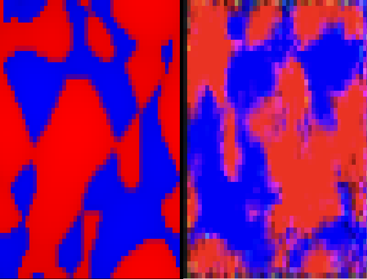

# Zaanen_Kruger_CNF.jl

Learn the probability distribution of 2D slices of high-dimensional **fermionic nodal surfaces** using **Conditional Continuous Normalising Flows (CNFs)** in the **FFJORD** style (neural ODEs + Hutchinson trace).

<p align="center">
   
</p>

> Image generator: fractal-like nodal images from the Frost Research Group’s [`Astowell.jl`](https://github.com/Frost-group/Astowell.jl).  
> Flow engine: [`ContinuousNormalizingFlows.jl`](https://github.com/impICNF/ContinuousNormalizingFlows.jl).

---

## The Project?

This project trains **conditional CNFs** to model the distribution of nodal-surface images inspired by the fractal phenomenology of **Krüger & Zaanen (PRB 2008)**. The aim is to reproduce the intricate nodal patterns while enabling fast sampling and density evaluation.

- **Approach:** FFJORD-style CNF (neural ODE vector field + unbiased log-det via Hutchinson’s estimator)  
- **Task:** Density estimation / generative modelling for nodal-surface images  
- **Main entry point:** `Testing_cnf.jl` (training script)
---
## Author 
Casano Kirlew

## Quick start
```bash
git clone https://github.com/Frost-group/Zaanen_Kruger_CNF.jl
cd Zaanen_Kruger_CNF.jl


